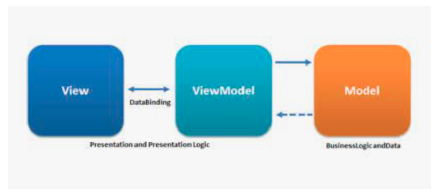
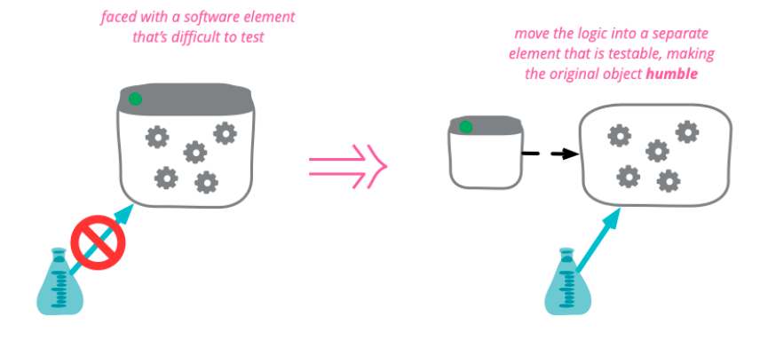

## ref

- [https://martinfowler.com/bliki/HumbleObject.html](https://martinfowler.com/bliki/HumbleObject.html)

---

### 험블 객체 패턴

- 테스트하기 어려운 행위와 테스트하기 쉬운 행위를 단위 테스트 작성자가 분리하기 쉽게 하는 방법.
- 행위들을 두 개의 모듈 혹은 클래스로 나눈다. 기본적인 본질만 남기고 테스트하기 어려운 행위를 모두 험블 객체로 옮긴다. 나머지 모듈에는 테스트하기 쉬운 행위를 옮긴다.

### 프레젠터와 뷰

- 뷰는 험블 객체이고 테스트하기 어려우므로, 객체에 포함된 코드를 가능한 간단하게 유지한다.
  - 뷰는 데이터를 직접 처리하지 않는다.
  - 뷰는 데이터를 화면으로 전달하는 간단한 일만 한다.
- 프레젠터는 테스트하기 쉬운 객체다. 데이터를 받아 화면에 표현할 수 있는 포멧으로 만든다.

**예시**

- 화면에 금액을 표시하고자 하면, 애플리케이션은 프레젠터에 Currency 객체를 전달한다.
- 프레젠터는 객체를 적절한 포멧으로 변환하여 뷰 모델에 저장한다.
  - 금액이 음수일때 빨간색이라면 간단한 bool 플래그를 뷰 모델에 저장한다.
- 화면에 보이는 버튼들의 이름은 뷰모델에 문자열로 존재한다.
- 버튼이 비활성화되어야 한다면 뷰모델에서 적절한 불타입 플래그를 설정한다.
- 애플리케이션에서 제어되어야 할 요소면 모두 뷰모델 내부에 문자열, 불, 열거형 형태로 표현한다.
- 뷰는 데이터를 화면으로 로드하고 그 외 역할은 없다.(humble)

### 테스트와 아키텍처

- 험블 객체 패턴을 활용하면, 테스트하기 용이한 객체를 만들 수 있다.
- 행위를 테스트하기 쉬운 부분과 테스트하기 어려운 부분으로 분리하여 아키텍처 경계를 정의하기 때문이다.

**데이터베이스 게이트웨이**

- 유스케이스 인터렉터와 데이터베이스 사이에 데이터베이스 게이트웨이가 존재한다.
- 게이트웨이는 애플리케이션이 수행하는 데이터베이스 관련 모든 메서드를 포함한다.
  - 사용자의 성 찾기 - `UserGateway` 인터페이스에서 `getLastNamesOfUsersWhoLoggedInAfter` 메서드를 호출.
- 유스케이스 계층은 SQL을 허용하지 않으므로, 애플리케이션은 이런 메서드를 호출하여야 한다.
- 인터페이스의 구현체는 데이터베이스 계층에 위치한다.(험블 객체)
- 험블 객체는 테스트하기 어려운 반면, 인터렉터는 애플리케이션 업무 규칙을 캡슐화하므로 테스트하기 용이하다. 데이터베이스 관련 메서드를 stub, test-double로 교체할 수 있기 때문이다.

**데이터 매퍼**

- ORM(Object Relational Mapper)는 존재하지 않고, 대신 데이터 매퍼가 더 나은 표현이다.
  - 객체는 데이터 구조가 아니기 때문이다. 데이터는 private으로 선언되어 사용자는 객체의 public 메서드만 볼 수 있다. 사용자 입장에서 객체는 오퍼레이션의 집합이다.
- 데이터 구조는 public 데이터 변수의 집합이다.
- ORM은 게이트웨이 인터페이스, 데이터베이스 사이 또 다른 험블 객체 경계이다.

**서비스 리스너**

- 외부에서 데이터를 수신한다면 서비스 리스너가 서비스 인터페이스로부터 데이터를 수신해 애플리케이션에서 사용할 수 있는 구조로 포멧을 변경한다.
- 여기서도 험블 객체를 만들 수 있다.

## 결론

- 아키텍처 경계마다 험블 객체 패턴을 발견할 수 있다.
- 경계를 넘나드는 통신은 데이터 구조를 수반하고, 경계는 테스트하기 어려운 부분과 쉬운 부분으로 나뉜다.
- 험블 객체 패턴을 사용하면 전체 시스템의 테스트 용이성을 높인다.
